<p align="center"></p>

# Eagle Exhumer

**Dig your old EAGLE designs out and bring them to KiCad 10 — with strong quality control.**

EAGLE support has ended, and many working boards exist only as EAGLE `.sch`/`.brd` files. KiCad's built-in EAGLE importer gets most of the way, but on real boards it leaves defects behind — split GND nets, lost net names, shorts from package copper, missing milling, an outline the zone filler cannot use — some of which only show up when the board comes back from the fab.

Eagle Exhumer runs KiCad's own importer, repairs the importer defects listed below, and then runs a strong quality control against the original EAGLE files, ending in a strict PASS / FAIL verdict and a report.

> Status: **0.9 testing**. KiCad 10.0. One-click import: Windows. Fix + check of an already imported project: all platforms (Linux/macOS experimental, untested).

## What the fixer repairs

| # | KiCad 10 importer defect | Effect on the board | Fix |
|---|---|---|---|
| 1 | Power symbols named from Value instead of the pin name | GND/VCC split in the schematic | Value = pin name |
| 2 | Eagle `nc` (direction) pins are never connected | open nets (16 on one Olimex board, GND and VCC included) | `nc` → passive where Eagle wires them |
| 3 | Unlabeled Eagle net names are lost | names gone from the PCB after F8 | global labels, each verified in the netlist |
| 4 | Package copper polygons with the pad's net | net-less copper → shorts | polygon → custom pad |
| 5 | Package copper between pads (printed jumper, board 0R: lines or rectangles) | short | net tie |
| 6 | NPTH holes with a copper ring | short | ring = drill |
| 7 | Net-less connector shield pads with GND routed in | shorting items | the one net that touches them |
| 8 | Via diameter ignores the Eagle restring rules | wrong annular ring | drill + 2·clamp(rv·drill) |
| 9 | Net class clearances; Eagle clearance matrix lost | false or missing DRC | net classes + `.kicad_dru` |
| 10 | Milling (layer 46) dropped | slots and cut-outs missing | Edge.Cuts / oval drills; drawings outside the board → Dwgs.User |
| 11 | Reference collision (`GND` → `GND0` that already exists) | two parts, one name | detected, reported |
| 12 | Multi-sheet projects: kicad-cli checks only the first sheet | checks see ~nothing | temporary hierarchical view |
| 13 | Board outline drawn inside a package → board-only footprint | zone fill almost empty (1 080 of 16 483 mm²) | outline moved to board level |
| 14 | KiCad Python `GetLength()` asserts on circles | script abort | own perimeter math |

## Install

**For testers, until the package is in KiCad's official repository:**
1. Download `eagle-exhumer-<version>-pcm.zip` from [Releases](https://github.com/z2labs/eagle-exhumer/releases).
2. In KiCad 10 open **Plugin and Content Manager → Install from File…** and pick the zip.
3. Restart the PCB Editor. The tombstone button appears in the toolbar.

Manual install also works: copy the `plugins/` folder to `Documents/KiCad/10.0/scripting/plugins/eagle-exhumer/`.

## Use

Open the **PCB Editor from the KiCad project manager**, not as a standalone app, then click the tombstone.

- **One-click import (Windows).** Pick the Eagle `.sch` or `.brd`, then the destination: a new `<design>_kicad` sub-folder next to the Eagle file, or any folder you choose. Eagle Exhumer then runs the whole chain unattended:
  1. drives KiCad's own *File → Import Non-KiCad Project → EAGLE*, filling in the dialogs and auto-matching layers;
  2. saves the project to `<design>_kicad/`;
  3. fixes it and runs the check;
  4. reopens the editors.
- **Fix + check (all platforms).** First import yourself with *File → Import Non-KiCad Project → EAGLE* and save. Then click the button and pick the Eagle file the project came from. The editors close, the project is fixed in place (a backup goes to `_eaglefix_backup/`), and the editors reopen. Running it again on a fixed project only re-checks it.

Results land in the project folder:

| File | What |
|---|---|
| `eaglefix_report.md` | everything that was changed, plus the **QC VERDICT** |
| `eaglefix_metrics.json`, `eaglefix_history.jsonl` | machine-readable metrics, one line per run |
| `docs/render_*.png` | 3D renders (top, bottom, iso) |
| `eagle_source/` | a copy of the Eagle files the check used |

Command line, without the GUI:
```
python eagle2kicad_fix.py <kicad_project_dir> --eagle-sch x.sch --eagle-brd x.brd [--verify-only] [--selftest] [--no-render]
```
Use KiCad's own Python (Windows: `C:\Program Files\KiCad\10.0\bin\python.exe`). Exit codes: `0` PASS, `1` QC FAIL, `3` QC self-check FAIL.

## Tested on

19 real designs: 11 open-hardware boards from [Olimex OLINUXINO](https://github.com/OLIMEX/OLINUXINO/tree/master/HARDWARE), 7 boards from Zoltan Doczi's own PCB designs and one private 4-sheet EAGLE 9.6.2 design — 3,214 parts, 14,044 pads, 7,610 vias, 1 to 6 copper layers. **18 of 19 pass the quality control**; the one FAIL is a reference collision (`GND` vs `GND0`) that needs a human decision.

KiCad 10.0.6 native import vs. after Eagle Exhumer 0.9.7, 18 batch designs (full re-run of the corpus, 2026-10-08):

| | native import | after fix |
|---|---|---|
| open (split) nets in the schematic | 49 | **0** |
| lost Eagle net names | 306 | **0** |
| ERC errors | 367 | 16 |
| DRC shorting items | 347 | 26 |

All 18 pass the quality control with a 6/6 self-check. The remaining ERC errors are 1–3 `power_pin_not_driven` / `pin_to_pin` items per board where the schematic has no explicit power source (a PWR_FLAG decision for a human; the count varies by ±1 between runs). Remaining DRC items are properties of the original EAGLE designs (e.g. clearance values the original violates, printed jumpers), which the conversion carries over rather than redesigning.

Timing on a desktop PC: import 23–31 s per design (board via `kicad-cli` 0.4–1.1 s, schematic via KiCad's GUI importer 22–29 s), fix + quality control + 3D renders 52–206 s depending on board size.

## Gallery

Converted boards, rendered from the KiCad projects Eagle Exhumer produced (filled zones; EAGLE designs carry no 3D models, so the boards are bare).

<table>
<tr><td align="center"><br><sub>A20-OLinuXino-MICRO Rev E2 (Olimex)</sub></td><td align="center">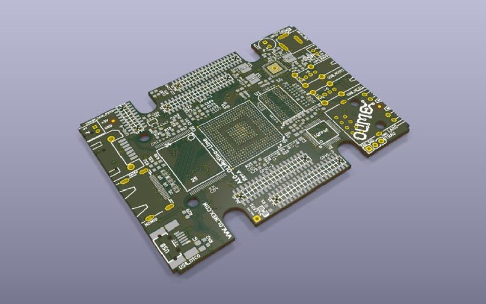<br><sub>A10-OLinuXino-Lime Rev A (Olimex)</sub></td></tr>
<tr><td align="center">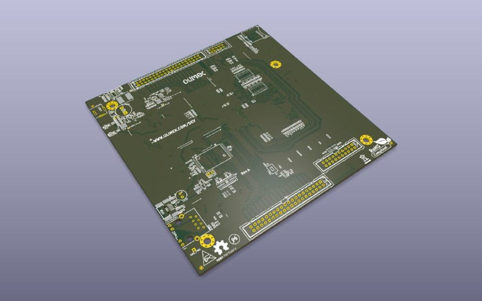<br><sub>AM3352-OLinuXino Rev A (Olimex)</sub></td><td align="center">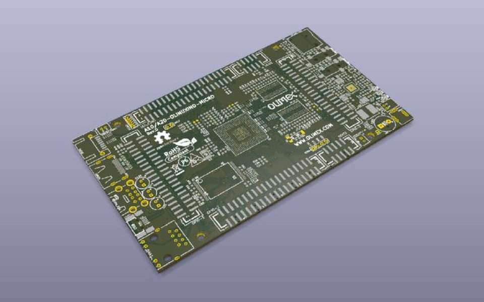<br><sub>A10/A20-OLinuXino-MICRO Rev D (Olimex)</sub></td></tr>
<tr><td align="center">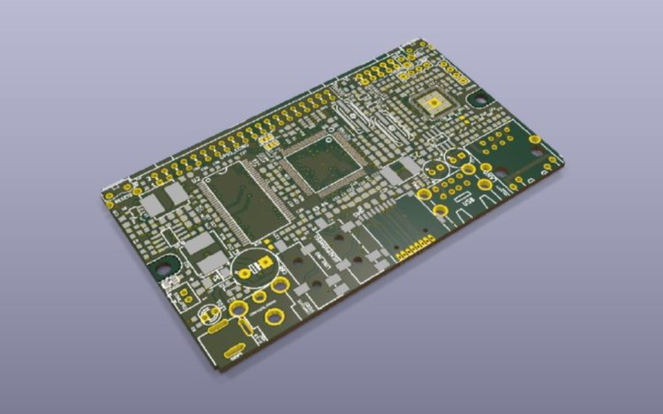<br><sub>iMX233-OLinuXino-MAXI Rev D (Olimex)</sub></td><td align="center">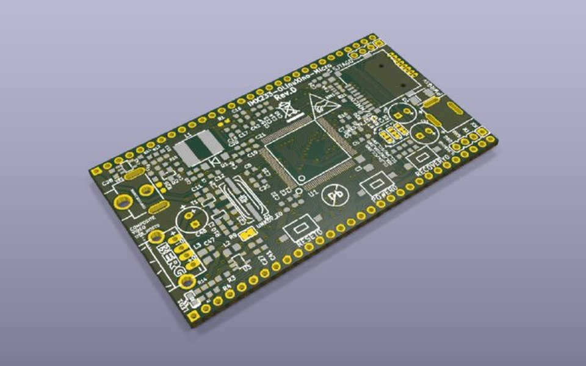<br><sub>iMX233-OLinuXino-Micro Rev D (Olimex)</sub></td></tr>
<tr><td align="center">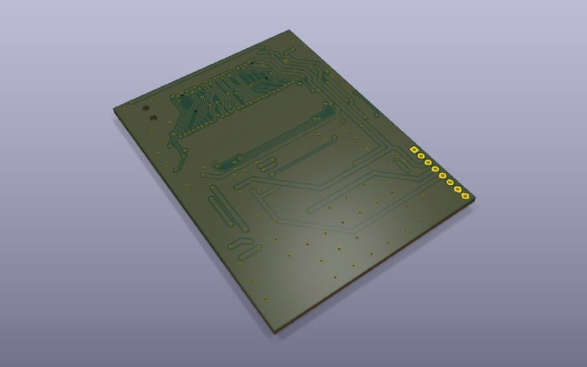<br><sub>LCD-OLinuXino-7TS Rev A (Olimex)</sub></td><td align="center">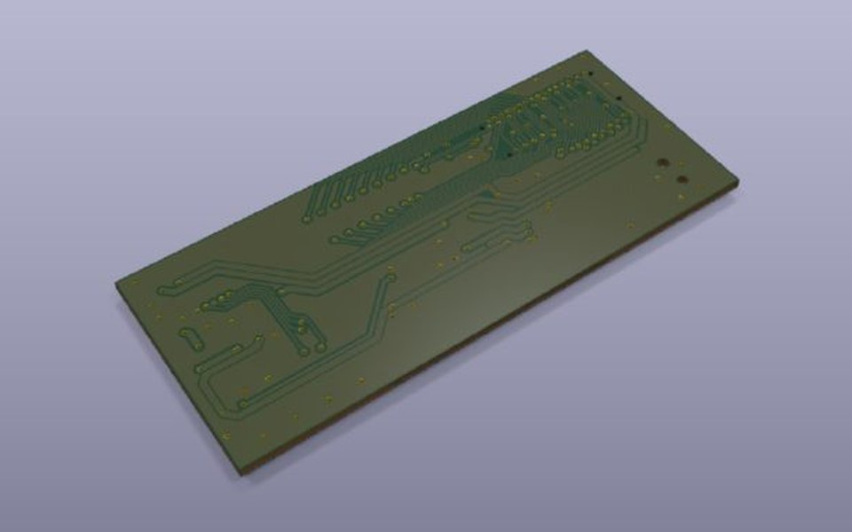<br><sub>LCD-OLinuXino-4.3TS Rev A (Olimex)</sub></td></tr>
<tr><td align="center">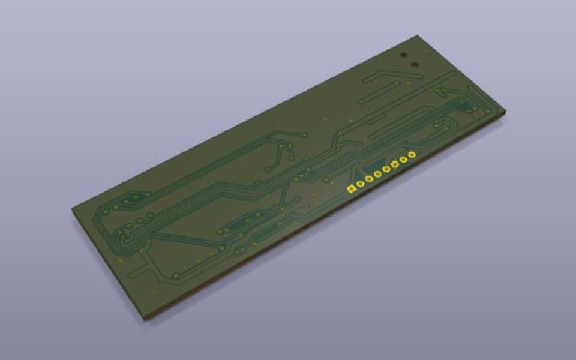<br><sub>A13-LCD10TS Rev A (Olimex)</sub></td><td align="center">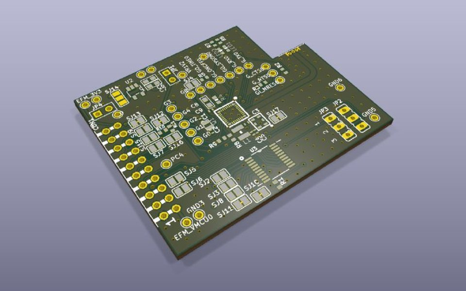<br><sub>Telit SE880 GPS module (Zoltan Doczi)</sub></td></tr>
<tr><td align="center">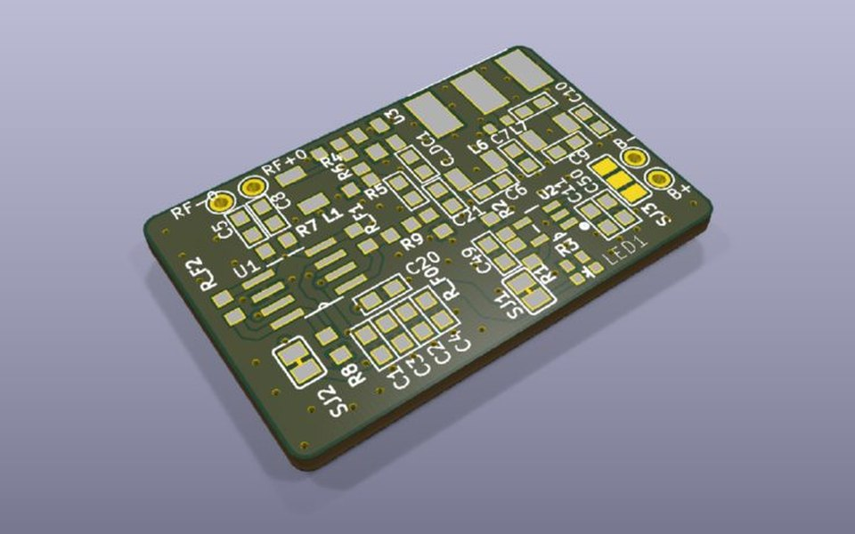<br><sub>RTL-SDR direct-sampling diff. amp (Zoltan Doczi)</sub></td><td align="center">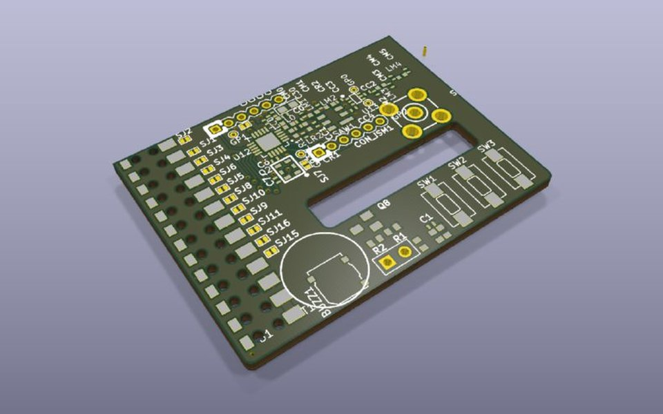<br><sub>RPi ISM adapter (Zoltan Doczi)</sub></td></tr>
<tr><td align="center">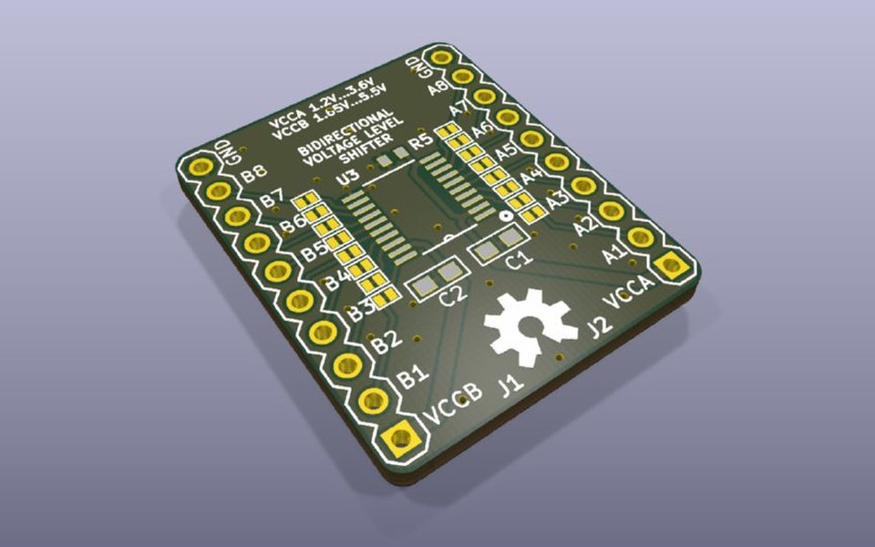<br><sub>TXS0108E level shifter (Zoltan Doczi)</sub></td><td align="center">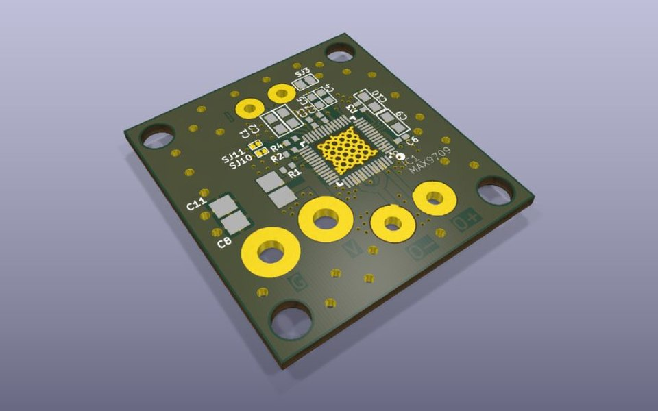<br><sub>MAX9709 bridge amplifier (Zoltan Doczi)</sub></td></tr>
<tr><td align="center">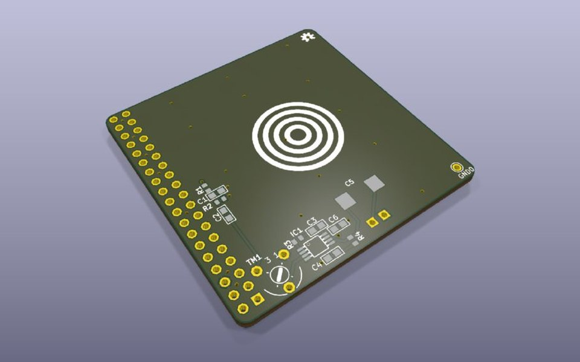<br><sub>RPi Speaker (Zoltan Doczi)</sub></td><td align="center">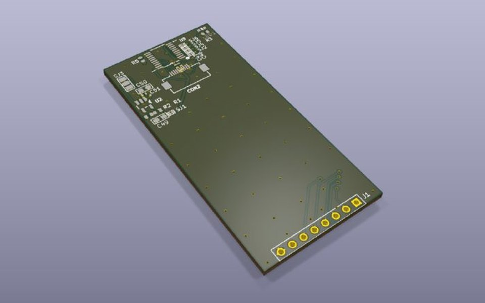<br><sub>LS013B7DH03 display module (Zoltan Doczi)</sub></td></tr>
</table>

<sub>Olimex designs © Olimex Ltd, open hardware from the [OLINUXINO repository](https://github.com/OLIMEX/OLINUXINO); other boards: Zoltan Doczi PCB designs. Renders are of the converted KiCad projects.</sub>

## Reporting problems

Click **Report a problem...** in the Eagle Exhumer window. It packs a diagnostic zip with the run report, metrics, logs and the versions of the plugin, KiCad and the OS, saves the zip next to your project, and opens a pre-filled [GitHub issue](https://github.com/z2labs/eagle-exhumer/issues/new?template=problem_report.yml). Drag the zip into the issue.

- Nothing is uploaded automatically.
- Design files (the KiCad project and the Eagle source) go into the zip **only if you say Yes**. GitHub issues are public, so only include designs you may share.
- From the command line: `python diag.py <kicad_project_dir> [--include-design]`.

## Known limits

- EAGLE 5 and older binary files cannot be read by KiCad. Save them once as XML in EAGLE 6+ or Fusion first.
- EAGLE designs carry no 3D models, so renders show the bare board.
- A reference collision stays a FAIL until you rename one of the parts.
- PWR_FLAG placement is not yet netlist-verified.
- No 3D models: EAGLE designs carry none. The report lists the footprints without a model as a warning, not a failure.
- Design-rule violations that exist in the Eagle original stay. The tool translates the design; it does not redesign it.
- This is a legacy SWIG Action Plugin. KiCad plans to replace that API, so a port to the IPC API will be needed for KiCad 11.

## License

GPL-3.0. See [LICENSE](LICENSE).

Not affiliated with or endorsed by Autodesk. EAGLE is a trademark of Autodesk, Inc., used here only to name the file format this tool reads. KiCad is a trademark of the KiCad project.

---

*Magyarul röviden:* régi EAGLE-tervek átvitele KiCad 10-be. A tool a KiCad saját importja után kijavítja a 14 ismert importhibát, majd szigorú minőségellenőrzéssel zárul. Hibát, kérést [issue](https://github.com/z2labs/eagle-exhumer/issues) formájában várunk.
